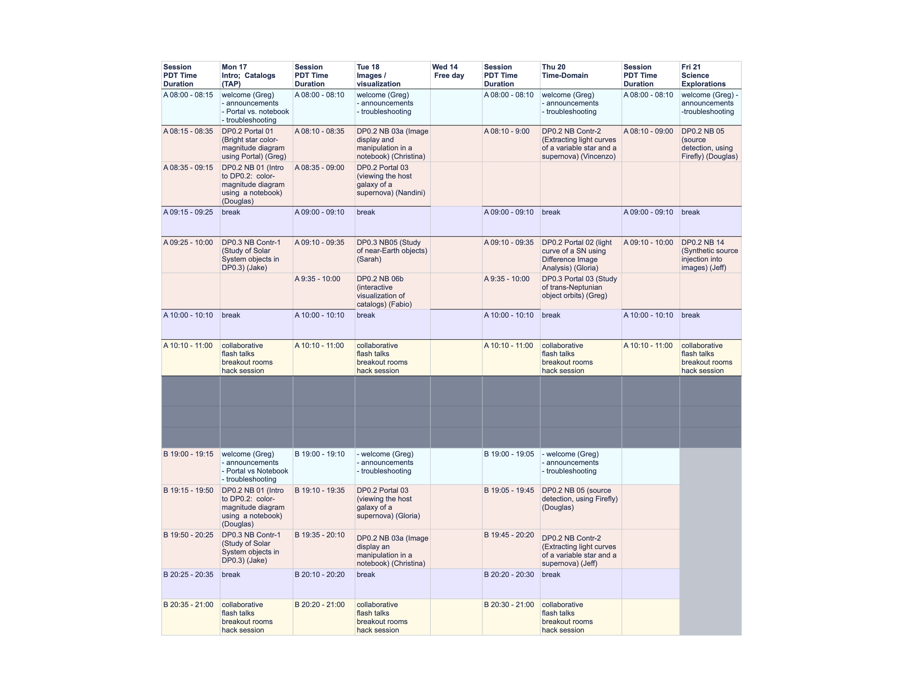

###########################
DP0 Rubin Data Academy 2024
###########################

.. Review the README on instructions to contribute.
.. Review the style guide to keep a consistent approach to the documentation.
.. Static objects, such as figures, should be stored in the _static directory. Review the _static/README on instructions to contribute.
.. Do not remove the comments that describe each section. They are included to provide guidance to contributors.
.. Do not remove other content provided in the templates, such as a section. Instead, comment out the content and include comments to explain the situation. For example:
	- If a section within the template is not needed, comment out the section title and label reference. Do not delete the expected section title, reference or related comments provided from the template.
    - If a file cannot include a title (surrounded by ampersands (#)), comment out the title from the template and include a comment explaining why this is implemented (in addition to applying the ``title`` directive).
.. This is the label that can be used for cross referencing this file.
.. Recommended title label format is "Directory Name"-"Title Name" -- Spaces should be replaced by hyphens.
.. _DP0-Delegate-Resources-RDA2024:
.. Each section should include a label for cross referencing to a given area.
.. Recommended format for all labels is "Title Name"-"Section Name" -- Spaces should be replaced by hyphens.
.. To reference a label that isn't associated with an reST object such as a title or figure, you must include the link and explicit title using the syntax :ref:`link text <label-name>`.
.. A warning will alert you of identical labels during the linkcheck process.

.. This section should provide a brief, top-level description of the page.

.. _DP0-Delegate-Resources-RDA2024-overview:

========
Overview
========

**Dates**: June 17-18, 20-21, 2024

**Times** (delegates may attend either session):

Session A: 8:00-11:00 PDT (15:00-18:00 UTC)

Session B: 19:00-21:00 PDT (02:00-04:00 UTC; +1 day)

**Location**: virtual

**Last modified**: June 11 2024

**Eligibility**: All DP0 delegates are eligible to register for the DP0 Rubin Data Academy.
There is currently space available for new DP0 delegates:
for more information about how to become a delegate, see the `"Getting started" document <https://dp0.lsst.io/delegate-resources/getting-started.html>`_.

**What is DP0?**
Rubin Data Previews use simulated data products, but the tools and the data formats are similar to what the real data and the `Rubin Science Platform (RSP) <https://dp0-2.lsst.io/data-access-analysis-tools/index.html#rubin-science-platform-rsp>`_ will look like.
This provides an excellent opportunity to prepare for the release of the first real data products.
There are two distinct datasets that are available for the delegates in the Data Preview 0 (DP0).

**Data Preview 0.2** (`DP0.2 <https://dp0-2.lsst.io>`_), released on June 30, 2022, is based on simulated
Legacy Survey of Space and Time (LSST)-like images that were generated by the Dark Energy Science Collaboration (DESC),
and then processed with the LSST Science Pipelines to provide data products (both images and catalogs)
in the same format as future (real) data releases.  These data products can be accessed and analyzed
via the web-based Rubin Science Platform (RSP).

**Data Preview 0.3** (`DP0.3 <https://dp0-3.lsst.io/index.html>`_), released around July 1, 2023, contains only
catalogs of simulated Solar System objects, including trans-Neptunian objects (TNOs), main belt asteroids (MBAs),
interstellar objects (ISOs), Hildas and Trojan asteroids, long-period comets, and near-Earth objects (NEOs).
The DP0.3 data set is composed of two sets of catalogs containing real
and simulated solar system and interstellar objects: one that represents LSST results after one year, and the other
represents LSST results at the end of the 10 year survey. The DP0.3 data set is hosted on, and
can be accessed via the Rubin Science Platform (RSP).  In the Data Academy, we will only consider the 10-year catalogs.

**Goals.**
The goal of this DP0 Rubin Data Academy is to introduce any data-rights holding scientist
(from undergraduate student to faculty/staff) to both the `DP0.2 dataset <https://dp0-2.lsst.io/data-products-dp0-2/index.html#the-desc-dc2-data-set>`_
and the `DP0.3 dataset <https://dp0-3.lsst.io/data-products-dp0-3/>`_,
as well as the RSP, and to provide an accelerated learning experience enabling research on Rubin data with a focus on both DP0 datasets.
In order to develop a thriving Rubin science community, another key goal of the Rubin Data Academy is to provide opportunities
for networking, collaboration, and new-skill acquisition for participants.

**Schedule.**
The Rubin Data Academy will span 4 days: between June 17 - 18 and June 20 - 21, where each day will be split into two 2-3 hr sessions
(each session covering essentially the same material) to accommodate the international time-zones of the participants.
The curriculum will cover key utilities of the RSP (e.g., Catalogs, Images, TAP, Butler) with guided tutorials by members of the
Rubin Community Science Team, and there will be dedicated time for collaborative discussions and hack sessions.
The primary meeting platform will be Zoom.

.. _DP0-Delegate-Resources-RDA2024-Registration:

=================
Registration form
=================

To register, please enter the requested information in the `registration form <https://docs.google.com/forms/d/1tZOUS9JCa4629LYTZPpQj4vqZCXH_23JMFtqj-GCXx0>`_.

.. _DP0-Delegate-Resources-RDA2024-SOC:

============================
Science Organizing Committee
============================

**CST Members:** Greg Madejski, Jeff Carlin, Sarah Greenstreet, Douglas Tucker, Christina Williams, Andres Plazas Malagon, Tina Adair, Gloria Fonseca Alvarez

**Delegate Members:** Jake Kurlander, Vincenzo Petrecca, Fabio Ragosta, Nandini Hazra

.. _DP0-Delegate-Resources-RDA2024-Agenda:

======
Agenda
======

The agenda is also available as a pdf file `here <../_static/rubin_data_academy_2024_agenda.pdf>`_.

.. Download the agenda as a txt file: :download:`agenda </_static/vss_agenda.txt>`.

Note that all times in the Agenda will be given in the PDT (Pacific Daylight Time) time zone.
For conversion to your local time, try `this time zone converter <https://www.timeanddate.com/worldclock/converter.html>`__ (use Los Angeles as the anchor for PDT).

.. _DP0-Delegate-Resources-RDA2024-Videos:

.. ======
.. Videos
.. ======

.. For information about the topics covered in each of these sessions, see the :ref:`agenda <DP0-Delegate-Resources-RDA2024-Agenda>` in the section above this one.

.. `Monday, June 12, Session A <https://youtu.be/ndNwbC1LADA>`__

.. `Monday, June 12, Session B <https://youtu.be/IAx74kMrC0E>`__

.. `Tuesday, June 13, Session A <https://youtu.be/4bge8CN5Ojg>`__

.. `Tuesday, June 13, Session B <https://youtu.be/R2QbRmqsiEw>`__

.. `Wednesday, June 14, Session A <https://youtu.be/dnXPTfybf0w>`__

.. `Wednesday, June 14, Session B <https://youtu.be/tuGrMPvFp-Y>`__

.. `Thursday, June 15, Session A <https://youtu.be/FrtXr3RGuKk>`__

.. `Thursday, June 15, Session B <https://youtu.be/pycrXcNij8M>`__

.. `Friday, June 16, Session A <https://youtu.be/26eqXwZp_64>`__

=============
Accessibility
=============

The CST will make this virtual workshop as accessible as we can for those attending. If there are any accommodations that would facilitate your participation, the registration form will include an anonymous request form.

The workshop will include automated captions, written instructions, and breaks.
All tutorials will be available beforehand and the website will include accessibility-related information.

.. _DP0-Delegate-Resources-RDA2024-Contact:

=======
Contact
=======

If you have any questions please contact Melissa Graham via direct message in the Rubin `Community Forum <https://community.lsst.org>`_ (preferred) or via email mlg3k AT uw DOT edu.
